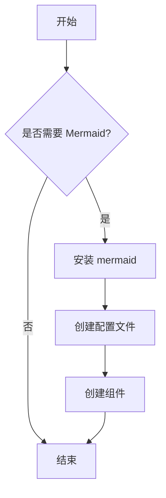
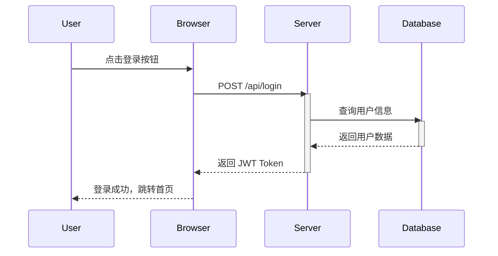
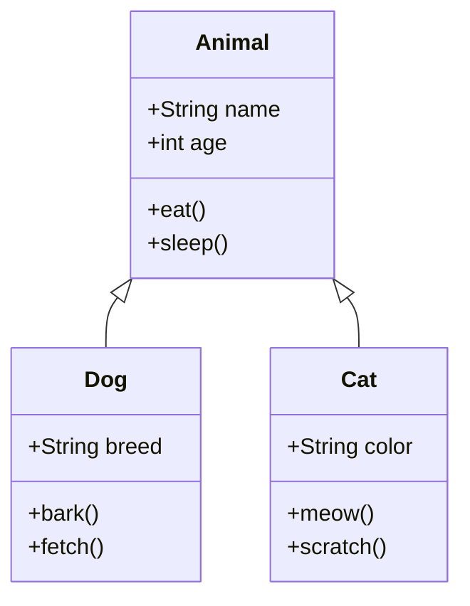
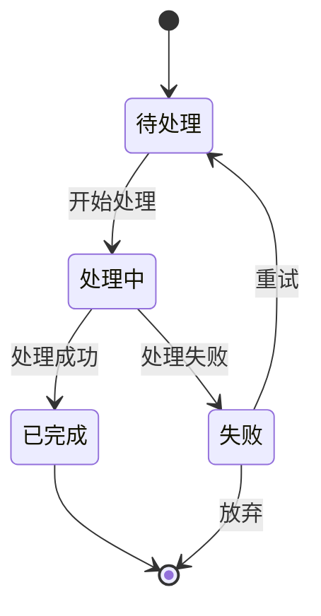
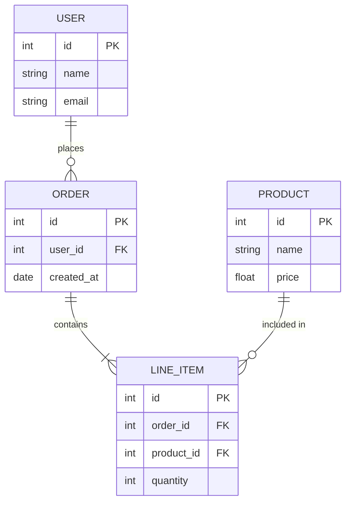
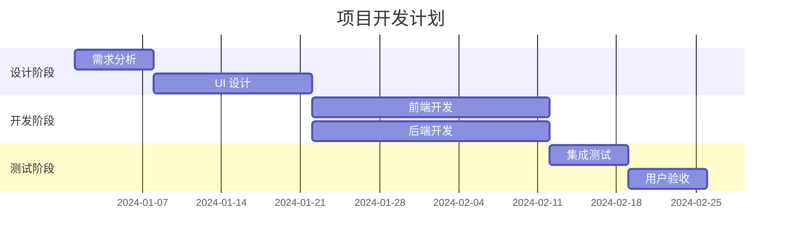
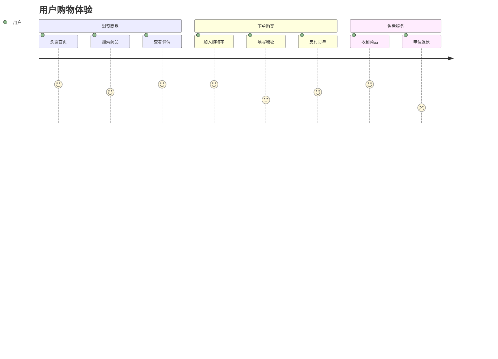
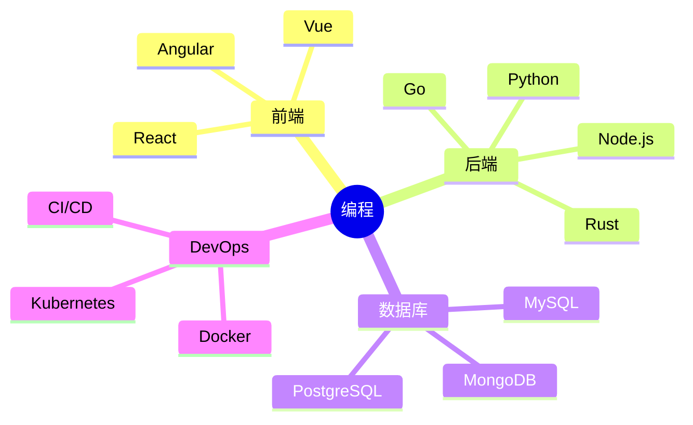
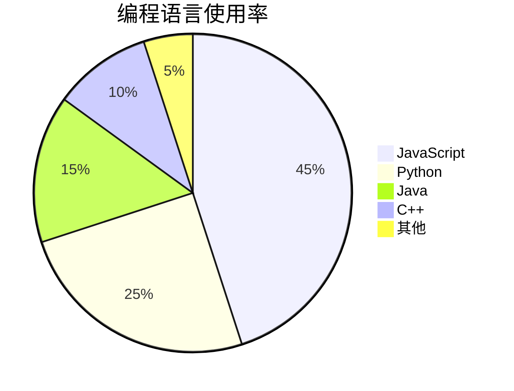
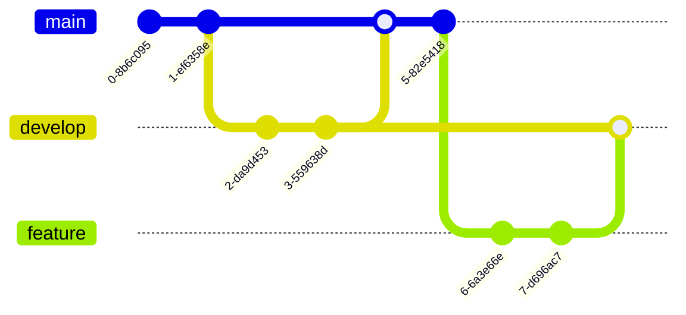

# Mermaid.js 图表测试

本文件包含各种 Mermaid 图表类型的示例，用于测试 Polaris 的图表渲染功能。

---

## 1. 流程图 (Flowchart)

---

## 2. 时序图 (Sequence Diagram)

---

## 3. 类图 (Class Diagram)

---

## 4. 状态图 (State Diagram)

---

## 5. ER 图 (Entity Relationship)

---

## 6. 甘特图 (Gantt Chart)

---

## 7. 用户旅程图 (Journey Diagram)

---

## 8. 思维导图 (Mindmap)

---

## 9. 饼图 (Pie Chart)

---

## 10. Git 图 (Git Graph)

---

## 测试说明

将以上内容复制到 Polaris 的聊天对话框中发送，AI 响应中的 Mermaid 代码块将被渲染为可视化图表。

### 预期效果：

1. **流程图**：显示决策树形状的流程图
2. **时序图**：显示各参与者之间的交互序列
3. **类图**：显示类继承关系
4. **状态图**：显示状态转换流程
5. **ER 图**：显示数据库表关系
6. **甘特图**：显示项目时间线
7. **用户旅程图**：显示用户体验各阶段的满意度
8. **思维导图**：显示知识结构
9. **饼图**：显示数据占比
10. **Git 图**：显示 Git 分支历史

所有图表应使用与 Polaris 一致的暗色主题样式。
