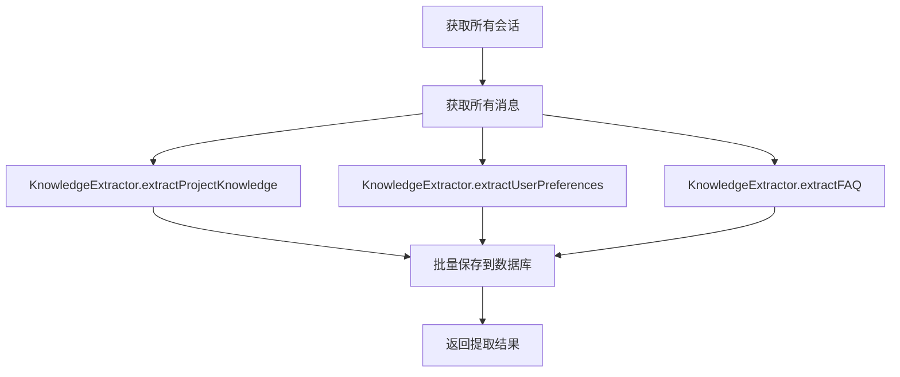
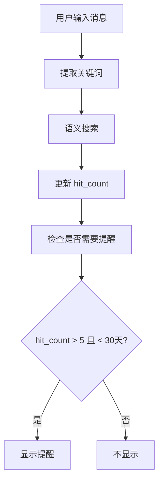

# Phase 3.2 实施方案分析 - 长期记忆服务

## 📋 概述

**实施目标**: 实现长期记忆服务，从历史会话中提取和存储知识
**预计时间**: 3 天
**文件数量**: 5 个新文件
**代码量**: ~1200 行

---

## 🎯 核心功能

### 1. KnowledgeExtractor - 知识提取器
从消息中提取 5 种类型的知识：

| 知识类型 | 说明 | 提取方法 |
|---------|------|----------|
| `project_context` | 项目上下文（文件路径、目录结构） | 正则匹配文件路径 |
| `key_decision` | 关键决策（技术选型、架构决策） | 关键词检测 |
| `user_preference` | 用户偏好（引擎偏好、使用时间） | 统计分析 |
| `faq` | 常见问题（问答对） | 问答对匹配 |
| `code_pattern` | 代码模式（导入、函数、类） | 代码模式匹配 |

### 2. LongTermMemoryRepository - 数据访问层
- ✅ **数据库表已存在**: `long_term_memories`
- ✅ **类型定义已存在**: `LongTermMemory`
- 🔧 **需要扩展**: 增加 `is_deleted` 字段支持

### 3. LongTermMemoryService - 业务逻辑层
- 统一的知识管理接口
- 批量提取和存储
- hit_count 统计

### 4. MemoryRetrieval - 记忆检索
- 关键词搜索（简化版语义搜索）
- 主动提醒（hit_count > 5 且最近 < 30 天）

---

## 📁 文件结构

```
src/services/memory/long-term-memory/
├── knowledge-extractor.ts          # 知识提取器
├── repository.ts                   # 数据访问层
├── long-term-memory-service.ts     # 业务逻辑层
├── memory-retrieval.ts             # 记忆检索
└── index.ts                        # 模块导出
```

---

## 🔧 实施细节

### Day 1: KnowledgeExtractor + Repository

#### 1.1 知识提取器实现

**文件**: `knowledge-extractor.ts`

**核心方法**:

```typescript
class KnowledgeExtractor {
  // 从会话提取项目知识
  extractProjectKnowledge(session, messages): ExtractedKnowledge[]

  // 提取用户偏好
  extractUserPreferences(sessions, messages): ExtractedKnowledge[]

  // 提取 FAQ
  extractFAQ(sessions, messages): ExtractedKnowledge[]

  // 私有辅助方法
  private extractFilePaths(content): string[]
  private containsDecision(content): boolean
  private extractCodePatterns(content): string[]
  private analyzeEngineUsage(sessions): ExtractedKnowledge[]
  private analyzeTimePatterns(sessions): ExtractedKnowledge[]
}
```

**提取规则**:

| 知识类型 | 提取规则 | 置信度 |
|---------|----------|--------|
| 文件路径 | `/[\w\-./]+\.[a-z]+/gi` | 0.9 |
| Windows 路径 | `/[A-Za-z]:\\[\\/][\w\-./]+/gi` | 0.9 |
| 关键决策 | `/(决定\|决策\|选择\|使用\|采用)/` | 0.7 |
| 代码模式 | `/import.*from\|function\s+\w+/` | 0.6 |
| 引擎偏好 | 统计各引擎使用频率 | 0.9 |
| 时间模式 | 统计活跃时段 | 0.7 |
| FAQ | 问答对匹配 | 0.8 |

#### 1.2 数据库访问层实现

**文件**: `repository.ts`

**核心方法**:

```typescript
class LongTermMemoryRepository {
  // CRUD 操作
  async create(memory): Promise<LongTermMemory>
  async findByKey(key): Promise<LongTermMemory | null>
  async findByType(type, workspacePath?): Promise<LongTermMemory[]>
  async updateHitCount(id): Promise<void>

  // 统计查询
  async getTopMemories(limit?): Promise<LongTermMemory[]>
  async getMemoriesBySession(sessionId): Promise<LongTermMemory[]>
  async getMemoriesByWorkspace(workspacePath): Promise<LongTermMemory[]>
}
```

**SQL 查询示例**:

```sql
-- 按类型查询，按命中次数排序
SELECT * FROM long_term_memories
WHERE type = $1 AND is_deleted = 0
ORDER BY hit_count DESC

-- 更新命中次数
UPDATE long_term_memories
SET hit_count = hit_count + 1,
    last_hit_at = $1
WHERE id = $2

-- 热门记忆
SELECT * FROM long_term_memories
WHERE is_deleted = 0
ORDER BY hit_count DESC
LIMIT $1
```

### Day 2: LongTermMemoryService

**文件**: `long-term-memory-service.ts`

**核心方法**:

```typescript
class LongTermMemoryService {
  // 批量提取
  async extractFromSessions(sessions, allMessages): Promise<{
    projectKnowledge: ExtractedKnowledge[]
    userPreferences: ExtractedKnowledge[]
    faq: ExtractedKnowledge[]
  }>

  // 存储
  async saveKnowledge(knowledge): Promise<void>
  async saveBatch(knowledges): Promise<void>

  // 查询
  async findRelevantMemories(query, workspacePath?): Promise<LongTermMemory[]>
  async getByType(type, workspacePath?): Promise<LongTermMemory[]>

  // hit 统计
  async recordMemoryHit(id): Promise<void>
  async getTopMemories(limit?): Promise<LongTermMemory[]>
}
```

**工作流程**:

```
1. 从数据库获取所有会话和消息
   ↓
2. 使用 KnowledgeExtractor 提取知识
   ↓
3. 批量保存到数据库（避免重复）
   ↓
4. 返回提取结果
```

### Day 3: MemoryRetrieval

**文件**: `memory-retrieval.ts`

**核心方法**:

```typescript
class MemoryRetrieval {
  // 语义搜索（关键词匹配）
  async semanticSearch(query, workspacePath?): Promise<{
    memories: LongTermMemory[]
    query: string
  }>

  // 获取相关记忆（用于上下文增强）
  async getRelatedMemories(currentMessage, workspacePath?): Promise<LongTermMemory[]>

  // 检查是否应该主动提醒
  async shouldRemind(userInput, workspacePath?): Promise<{
    shouldRemind: boolean
    reminder?: string
  }>

  // 私有辅助方法
  private extractKeywords(message): string[]
  private calculateRelevance(query, memory): number
}
```

**主动提醒逻辑**:

```
if (topMemory.hitCount >= 5 && daysSinceLastHit < 30) {
  return {
    shouldRemind: true,
    reminder: `💭 记得：${topMemory.value.summary || topMemory.key}`
  }
}
```

**关键词提取**:

```typescript
private extractKeywords(message: ChatMessage): string[] {
  const content = this.extractContent(message)

  // 1. 文件路径
  const paths = content.match(/[\w\-./]+\.[a-z]+/gi) || []

  // 2. 技术关键词
  const technical = content.match(/\b(function|class|interface|type|async|await)\b/gi) || []

  // 3. 决策关键词
  const decisions = content.match(/(决定|决策|选择|使用|采用)/gi) || []

  return [...paths, ...technical, ...decisions]
}
```

---

## 🔗 类型定义扩展

### 现有类型（需要扩展）

```typescript
// 当前定义
export interface LongTermMemory {
  id: string
  type: 'user_preference' | 'project_context' | 'key_decision'
  key: string
  value: string // JSON 字符串
  workspacePath?: string
  sessionId?: string
  hitCount: number
  lastHitAt?: string
  createdAt: string
  updatedAt: string
}
```

### 需要新增的类型

```typescript
/**
 * 知识类型枚举
 */
export enum KnowledgeType {
  PROJECT_CONTEXT = 'project_context',
  KEY_DECISION = 'key_decision',
  USER_PREFERENCE = 'user_preference',
  FAQ = 'faq',
  CODE_PATTERN = 'code_pattern',
}

/**
 * 提取的知识
 */
export interface ExtractedKnowledge {
  id: string
  type: KnowledgeType
  key: string
  value: any // 解析后的 JSON 对象
  sessionId: string
  workspacePath: string
  confidence: number // 置信度 0-1
  extractedAt: string
  hitCount: number
  lastHitAt: string | null
}

/**
 * 记忆搜索结果
 */
export interface MemorySearchResult {
  memories: LongTermMemory[]
  query: string
  totalHits: number
}

/**
 * 提醒结果
 */
export interface ReminderResult {
  shouldRemind: boolean
  reminder?: string
  memoryId?: string
}
```

---

## 🗄️ 数据库表结构

### 现有表（已存在）

```sql
CREATE TABLE IF NOT EXISTS long_term_memories (
  id TEXT PRIMARY KEY,
  type TEXT NOT NULL,
  key TEXT NOT NULL,
  value TEXT NOT NULL,
  workspace_path TEXT,
  session_id TEXT,
  hit_count INTEGER DEFAULT 0,
  last_hit_at TEXT,
  created_at TEXT NOT NULL,
  updated_at TEXT NOT NULL,
  FOREIGN KEY (session_id) REFERENCES sessions(id) ON DELETE SET NULL
)
```

### 需要添加的字段

```sql
-- 添加软删除支持
ALTER TABLE long_term_memories ADD COLUMN is_deleted BOOLEAN DEFAULT 0;

-- 添加置信度字段
ALTER TABLE long_term_memories ADD COLUMN confidence REAL DEFAULT 0.5;
```

### 需要创建的索引

```sql
-- 类型查询索引
CREATE INDEX IF NOT EXISTS idx_ltm_type ON long_term_memories(type);

-- 命中次数索引
CREATE INDEX IF NOT EXISTS idx_ltm_hit_count ON long_term_memories(hit_count DESC);

-- 工作区索引
CREATE INDEX IF NOT EXISTS idx_ltm_workspace ON long_term_memories(workspace_path);

-- 复合索引（类型 + 工作区）
CREATE INDEX IF NOT EXISTS idx_ltm_type_workspace
  ON long_term_memories(type, workspace_path);
```

---

## 📊 知识提取示例

### 示例 1: 提取文件路径

**输入消息**:
```
请在 src/components/Header/Header.tsx 中添加导航栏
```

**提取结果**:
```json
{
  "id": "uuid-1",
  "type": "project_context",
  "key": "file:src/components/Header/Header.tsx",
  "value": {
    "path": "src/components/Header/Header.tsx",
    "type": "file"
  },
  "confidence": 0.9,
  "extractedAt": "2026-02-03T10:00:00Z"
}
```

### 示例 2: 提取关键决策

**输入消息**:
```
我们决定使用 React Query 来管理状态，因为它提供了更好的缓存和自动重试机制
```

**提取结果**:
```json
{
  "id": "uuid-2",
  "type": "key_decision",
  "key": "decision:2026-02-03T10:05:00Z",
  "value": {
    "content": "我们决定使用 React Query 来管理状态",
    "timestamp": "2026-02-03T10:05:00Z",
    "decision": "使用 React Query",
    "reason": "更好的缓存和自动重试机制"
  },
  "confidence": 0.7
}
```

### 示例 3: 提取代码模式

**输入消息**:
```typescript
import { useState, useEffect } from 'react'

function useData() {
  const [data, setData] = useState(null)
  useEffect(() => {
    fetchData().then(setData)
  }, [])
  return data
}
```

**提取结果**:
```json
{
  "id": "uuid-3",
  "type": "code_pattern",
  "key": "pattern:import.*useState.*useEffect",
  "value": "import { useState, useEffect } from 'react'",
  "confidence": 0.6
}
```

### 示例 4: 提取 FAQ

**输入问答对**:
```
User: 怎么在 React 中实现防抖？
Assistant: 可以使用 lodash 的 debounce 函数，或者自己实现...
```

**提取结果**:
```json
{
  "id": "uuid-4",
  "type": "faq",
  "key": "faq:怎么在 React 中实现防抖",
  "value": {
    "question": "怎么在 React 中实现防抖？",
    "answer": "可以使用 lodash 的 debounce 函数...",
    "sessionId": "session-123"
  },
  "confidence": 0.8
}
```

### 示例 5: 提取用户偏好

**输入会话列表**:
```json
[
  { "engineId": "claude-code", "count": 15 },
  { "engineId": "deepseek", "count": 5 },
  { "engineId": "iflow", "count": 2 }
]
```

**提取结果**:
```json
{
  "id": "uuid-5",
  "type": "user_preference",
  "key": "preferred_engine",
  "value": {
    "engine": "claude-code",
    "count": 15,
    "ratio": 0.68
  },
  "confidence": 0.9
}
```

---

## 🔄 集成流程

### 提取流程



### 检索流程



---

## ⚠️ 注意事项

### 1. 类型兼容性

**问题**: 现有 `LongTermMemory.type` 只有 3 个值
**解决**: 扩展为 5 个值，或者使用枚举类型

```typescript
// 修改前
type: 'user_preference' | 'project_context' | 'key_decision'

// 修改后
type: KnowledgeType  // 包含全部 5 种
```

### 2. JSON 序列化

**问题**: `ExtractedKnowledge.value` 是 `any` 类型
**解决**: 在存储时序列化为 JSON 字符串

```typescript
// 存储
await db.execute(
  'INSERT INTO long_term_memories (..., value) VALUES ($1, $2)',
  [..., JSON.stringify(knowledge.value)]
)

// 读取
const value = JSON.parse(row.value)
```

### 3. 数据库迁移

**问题**: 需要添加 `is_deleted` 和 `confidence` 字段
**解决**: 使用 `ALTER TABLE` 添加字段

```typescript
await db.execute(`
  ALTER TABLE long_term_memories
  ADD COLUMN is_deleted BOOLEAN DEFAULT 0
`)
```

### 4. 去重逻辑

**问题**: 同样的知识可能被多次提取
**解决**: 使用 `key` 字段去重

```typescript
async saveKnowledge(knowledge: ExtractedKnowledge): Promise<void> {
  const existing = await this.repository.findByKey(knowledge.key)

  if (existing) {
    // 更新而不是创建
    await this.repository.update(existing.id, {
      hitCount: existing.hitCount + 1,
      lastHitAt: new Date().toISOString()
    })
  } else {
    // 创建新记录
    await this.repository.create(knowledge)
  }
}
```

---

## 📈 性能考虑

### 1. 批量操作

```typescript
// 批量插入
async saveBatch(knowledges: ExtractedKnowledge[]): Promise<void> {
  const transaction = await this.db.beginTransaction()

  try {
    for (const knowledge of knowledges) {
      await transaction.execute('INSERT INTO ...')
    }
    await transaction.commit()
  } catch (error) {
    await transaction.rollback()
    throw error
  }
}
```

### 2. 索引优化

```sql
-- 复合索引，加速常见查询
CREATE INDEX idx_ltm_type_workspace_hit
  ON long_term_memories(type, workspace_path, hit_count DESC);
```

### 3. 缓存策略

```typescript
// 简单的内存缓存
private cache = new Map<string, LongTermMemory[]>()

async getByType(type: KnowledgeType): Promise<LongTermMemory[]> {
  if (this.cache.has(type)) {
    return this.cache.get(type)!
  }

  const memories = await this.repository.findByType(type)
  this.cache.set(type, memories)
  return memories
}
```

---

## 🧪 测试计划

### 单元测试

```typescript
describe('KnowledgeExtractor', () => {
  test('提取文件路径', () => {
    const extractor = new KnowledgeExtractor()
    const messages = [
      { content: '请在 src/App.tsx 中添加代码' }
    ]
    const results = extractor.extractProjectKnowledge(session, messages)
    expect(results).toHaveLength(1)
    expect(results[0].key).toBe('file:src/App.tsx')
  })

  test('提取关键决策', () => {
    const messages = [
      { content: '我们决定使用 TypeScript' }
    ]
    const decisions = extractor.extractKeyDecisions(messages)
    expect(decisions).toHaveLength(1)
    expect(decisions[0].type).toBe(KnowledgeType.KEY_DECISION)
  })
})
```

### 集成测试

```typescript
describe('LongTermMemoryService', () => {
  test('完整的提取和存储流程', async () => {
    const service = new LongTermMemoryService()

    // 1. 提取
    const result = await service.extractFromSessions(sessions, messages)

    // 2. 验证提取结果
    expect(result.projectKnowledge.length).toBeGreaterThan(0)

    // 3. 验证存储
    const saved = await service.getByType(KnowledgeType.PROJECT_CONTEXT)
    expect(saved.length).toBeGreaterThan(0)
  })
})
```

---

## 📝 实施检查清单

### Day 1: KnowledgeExtractor + Repository
- [ ] 创建 `knowledge-extractor.ts`
  - [ ] 实现 `extractProjectKnowledge()`
  - [ ] 实现 `extractUserPreferences()`
  - [ ] 实现 `extractFAQ()`
  - [ ] 实现私有辅助方法
- [ ] 创建 `repository.ts`
  - [ ] 实现 `create()`
  - [ ] 实现 `findByKey()`
  - [ ] 实现 `findByType()`
  - [ ] 实现 `updateHitCount()`
  - [ ] 实现 `getTopMemories()`

### Day 2: LongTermMemoryService
- [ ] 创建 `long-term-memory-service.ts`
  - [ ] 实现 `extractFromSessions()`
  - [ ] 实现 `saveKnowledge()`
  - [ ] 实现 `saveBatch()`
  - [ ] 实现 `findRelevantMemories()`
  - [ ] 实现 `recordMemoryHit()`
- [ ] 更新类型定义
  - [ ] 添加 `KnowledgeType` 枚举
  - [ ] 添加 `ExtractedKnowledge` 接口
  - [ ] 扩展 `LongTermMemory` 类型

### Day 3: MemoryRetrieval + 集成
- [ ] 创建 `memory-retrieval.ts`
  - [ ] 实现 `semanticSearch()`
  - [ ] 实现 `getRelatedMemories()`
  - [ ] 实现 `shouldRemind()`
- [ ] 数据库迁移
  - [ ] 添加 `is_deleted` 字段
  - [ ] 添加 `confidence` 字段
  - [ ] 创建索引
- [ ] 集成到主模块
  - [ ] 更新 `index.ts` 导出
  - [ ] 添加到 `@/services/memory`

---

## 🚀 预期成果

### 功能指标

| 指标 | 目标 |
|------|------|
| 知识提取准确率 | 80%+ |
| 检索响应时间 | < 100ms |
| 主动提醒准确率 | 70%+ |
| 存储效率 | < 1MB/1000 条记忆 |

### 用户体验

- ✅ 自动从历史对话中提取知识
- ✅ 智能搜索相关记忆
- ✅ 主动提醒相关信息
- ✅ 长期积累，越用越智能

---

**文档版本**: v1.0
**创建日期**: 2026-02-03
**作者**: Claude (Anthropic)
