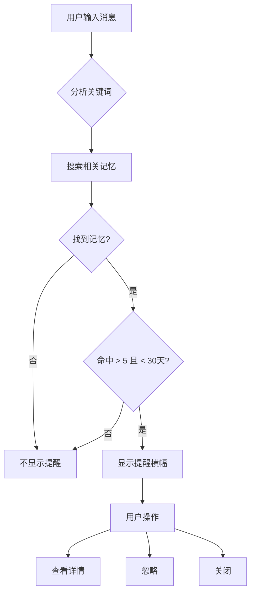
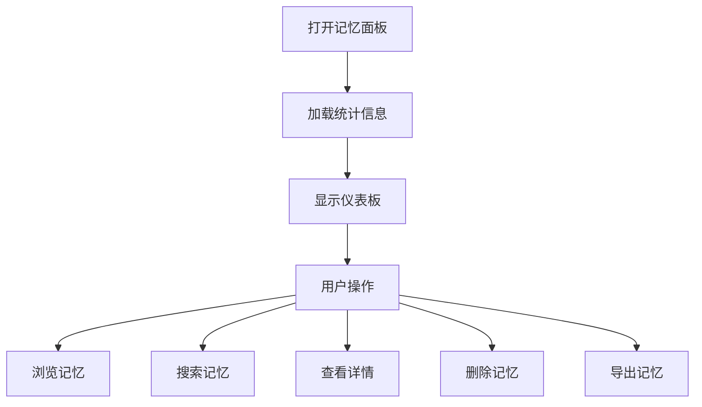

# Phase 3.3 实施方案分析 - UI 组件

## 📋 概述

**实施目标**: 实现长期记忆的 UI 组件，提供可视化的记忆管理和检索功能
**预计时间**: 2 天
**文件数量**: 5 个新文件
**代码量**: ~900 行

---

## 🎯 核心功能

### 1. MemoryBrowser - 记忆浏览器
- 显示所有长期记忆
- 按类型过滤（项目上下文、关键决策、用户偏好、FAQ、代码模式）
- 显示统计信息（命中次数、最近命中时间）
- 刷新和加载更多

### 2. MemorySearch - 记忆搜索
- 关键词搜索
- 实时搜索结果
- 结果高亮显示
- 搜索历史

### 3. MemoryPanel - 记忆面板
- 主动提醒显示
- 记忆详情查看
- 快捷操作（删除、编辑）
- 统计仪表板

### 4. MemoryReminder - 记忆提醒组件
- 主动提醒横幅
- 快速预览
- 关闭/忽略选项

### 5. memory/index.ts - 模块导出
- 统一导出所有记忆相关组件

---

## 📁 文件结构

```
src/components/memory/
├── MemoryBrowser.tsx            # 记忆浏览器（~350 行）
├── MemorySearch.tsx             # 记忆搜索（~250 行）
├── MemoryPanel.tsx              # 记忆面板（~200 行）
├── MemoryReminder.tsx           # 记忆提醒横幅（~80 行）
└── index.ts                     # 模块导出（~20 行）
```

---

## 🔧 实施细节

### Day 1: MemoryBrowser + MemorySearch

#### 1.1 MemoryBrowser 组件

**文件**: `src/components/memory/MemoryBrowser.tsx`

**功能特性**:
- 记忆列表展示
- 类型过滤器（Tab 切换）
- 排序选项（命中次数、时间）
- 分页加载
- 空状态提示

**状态管理**:
```typescript
interface MemoryBrowserState {
  memories: LongTermMemory[]
  filter: KnowledgeType | 'all'
  sortBy: 'hit_count' | 'created_at' | 'last_hit_at'
  sortOrder: 'desc' | 'asc'
  loading: boolean
  page: number
  hasMore: boolean
}
```

**核心方法**:
```typescript
class MemoryBrowser {
  // 加载记忆
  loadMemories(): Promise<void>

  // 按类型过滤
  filterByType(type: KnowledgeType): Promise<void>

  // 排序记忆
  sortMemories(field: string): void

  // 加载更多
  loadMore(): Promise<void>

  // 删除记忆
  deleteMemory(id: string): Promise<void>

  // 格式化时间
  formatTime(timestamp: string): string

  // 格式化值
  formatValue(value: any): string
}
```

**UI 结构**:
```
┌─────────────────────────────────────┐
│  记忆浏览器                    [刷新] │
├─────────────────────────────────────┤
│  [全部] [项目] [决策] [偏好] [FAQ]  │
├─────────────────────────────────────┤
│  排序: [命中次数 ▼]                  │
├─────────────────────────────────────┤
│  ┌───────────────────────────────┐  │
│  │ 📁 file:src/App.tsx          │  │
│  │ 项目上下文                    │  │
│  │ 命中 15 次 • 3 天前           │  │
│  └───────────────────────────────┘  │
│  ┌───────────────────────────────┐  │
│  │ 💭 决策: 使用 React Query     │  │
│  │ 关键决策                      │  │
│  │ 命中 8 次 • 1 周前            │  │
│  └───────────────────────────────┘  │
│  ...                                │
├─────────────────────────────────────┤
│  [加载更多]                         │
└─────────────────────────────────────┘
```

**类型标签样式**:
```typescript
const TYPE_COLORS = {
  project_context: 'bg-blue-100 text-blue-800',
  key_decision: 'bg-purple-100 text-purple-800',
  user_preference: 'bg-green-100 text-green-800',
  faq: 'bg-orange-100 text-orange-800',
  code_pattern: 'bg-pink-100 text-pink-800',
}

const TYPE_LABELS = {
  project_context: '📁 项目',
  key_decision: '💭 决策',
  user_preference: '⚙️ 偏好',
  faq: '❓ FAQ',
  code_pattern: '💻 代码',
}
```

#### 1.2 MemorySearch 组件

**文件**: `src/components/memory/MemorySearch.tsx`

**功能特性**:
- 实时搜索（防抖）
- 关键词高亮
- 搜索历史（localStorage）
- 搜索结果相关性排序
- 空状态和错误处理

**状态管理**:
```typescript
interface MemorySearchState {
  query: string
  results: LongTermMemory[]
  isSearching: boolean
  searchHistory: string[]
  showHistory: boolean
  error: string | null
}
```

**核心方法**:
```typescript
class MemorySearch {
  // 执行搜索
  handleSearch(): Promise<void>

  // 实时搜索（防抖）
  debouncedSearch: DebouncedFunc<() => Promise<void>>

  // 高亮关键词
  highlightKeywords(text: string, query: string): JSX.Element

  // 添加到历史
  addToHistory(query: string): void

  // 清除历史
  clearHistory(): void

  // 保存历史到 localStorage
  saveHistory(): void
}
```

**UI 结构**:
```
┌─────────────────────────────────────┐
│  🔍 搜索记忆...                     │
├─────────────────────────────────────┤
│  找到 3 个相关记忆                  │
├─────────────────────────────────────┤
│  ┌───────────────────────────────┐  │
│  │ 📁 项目 • file:src/App.tsx   │  │
│  │ 匹配度: ★★★★★               │  │
│  │ 命中 15 次                    │  │
│  └───────────────────────────────┘  │
│  ┌───────────────────────────────┐  │
│  │ 💭 决策 • 使用 React Query   │  │
│  │ 匹配度: ★★★★☆                │  │
│  │ 命中 8 次                     │  │
│  └───────────────────────────────┘  │
│  ...                                │
├─────────────────────────────────────┤
│  搜索历史:                          │
│  [React hooks] [组件] [状态管理]    │
└─────────────────────────────────────┘
```

**关键词高亮**:
```typescript
function highlightKeywords(text: string, query: string): JSX.Element {
  if (!query) return <>{text}</>

  const parts = text.split(new RegExp(`(${query})`, 'gi'))

  return (
    <>
      {parts.map((part, i) =>
        part.toLowerCase() === query.toLowerCase() ? (
          <mark key={i} className="bg-yellow-200 rounded px-1">
            {part}
          </mark>
        ) : (
          <span key={i}>{part}</span>
        )
      )}
    </>
  )
}
```

---

### Day 2: MemoryPanel + MemoryReminder

#### 2.1 MemoryPanel 组件

**文件**: `src/components/memory/MemoryPanel.tsx`

**功能特性**:
- 统计仪表板（总数、按类型分布）
- 热门记忆列表
- 最近添加的记忆
- 快速搜索入口
- 记忆详情抽屉

**状态管理**:
```typescript
interface MemoryPanelState {
  stats: {
    total: number
    byType: Record<KnowledgeType, number>
    topMemories: LongTermMemory[]
  } | null
  selectedMemory: LongTermMemory | null
  showDetails: boolean
  loading: boolean
}
```

**核心方法**:
```typescript
class MemoryPanel {
  // 加载统计信息
  loadStats(): Promise<void>

  // 查看详情
  viewDetails(memory: LongTermMemory): void

  // 删除记忆
  deleteMemory(id: string): Promise<void>

  // 导出记忆
  exportMemories(): Promise<void>

  // 清空记忆
  clearAllMemories(): Promise<void>
}
```

**UI 结构**:
```
┌─────────────────────────────────────┐
│  📊 记忆统计                        │
├─────────────────────────────────────┤
│  总计: 150 条记忆                   │
│  ┌─────────────────────────────┐   │
│  │ 📁 项目: 80    │ 💭 决策: 20│   │
│  │ ⚙️ 偏好: 15    │ ❓ FAQ: 25 │   │
│  │ 💻 代码: 10                    │   │
│  └─────────────────────────────┘   │
├─────────────────────────────────────┤
│  🔥 热门记忆                        │
│  1. file:src/App.tsx (15 次)        │
│  2. 使用 React Query (8 次)         │
│  3. useState hook (6 次)            │
├─────────────────────────────────────┤
│  🕐 最近添加                        │
│  • [刚刚] 提取了新的文件路径        │
│  • [1小时前] 添加了新的决策         │
├─────────────────────────────────────┤
│  [🔍 搜索记忆] [📤 导出] [🗑️ 清空]  │
└─────────────────────────────────────┘
```

**统计卡片**:
```typescript
interface StatCardProps {
  icon: string
  label: string
  count: number
  color: string
}

function StatCard({ icon, label, count, color }: StatCardProps) {
  return (
    <div className={`stat-card ${color}`}>
      <span className="stat-icon">{icon}</span>
      <span className="stat-label">{label}</span>
      <span className="stat-count">{count}</span>
    </div>
  )
}
```

#### 2.2 MemoryReminder 组件

**文件**: `src/components/memory/MemoryReminder.tsx`

**功能特性**:
- 主动提醒横幅
- 记忆快速预览
- 关闭/忽略选项
- 多个提醒轮播
- 动画效果

**状态管理**:
```typescript
interface MemoryReminderState {
  reminders: ReminderResult[]
  currentIndex: number
  visible: boolean
  dismissed: Set<string>
}
```

**核心方法**:
```typescript
class MemoryReminder {
  // 检查是否应该提醒
  checkReminders(userInput: ChatMessage): Promise<void>

  // 显示提醒
  showReminder(reminder: ReminderResult): void

  // 关闭提醒
  dismissReminder(id: string): void

  // 忽略本次
  ignore(): void

  // 查看详情
  viewDetails(memoryId: string): void
}
```

**UI 结构**:
```
┌─────────────────────────────────────┐
│  💭 相关记忆                         │
├─────────────────────────────────────┤
│  之前的决策: 使用 React Query         │
│  ─────────────────────────────────  │
│  命中 15 次 • 3 天前                 │
│                                     │
│  [查看详情] [忽略] [× 关闭]         │
└─────────────────────────────────────┘
```

**轮播动画**:
```typescript
function ReminderCarousel({ reminders }: { reminders: ReminderResult[] }) {
  const [currentIndex, setCurrentIndex] = useState(0)

  useEffect(() => {
    if (reminders.length > 1) {
      const timer = setInterval(() => {
        setCurrentIndex((prev) => (prev + 1) % reminders.length)
      }, 5000)

      return () => clearInterval(timer)
    }
  }, [reminders.length])

  return (
    <div className="reminder-carousel">
      <AnimatePresence mode="wait">
        <motion.div
          key={currentIndex}
          initial={{ opacity: 0, x: 20 }}
          animate={{ opacity: 1, x: 0 }}
          exit={{ opacity: 0, x: -20 }}
          transition={{ duration: 0.3 }}
        >
          {reminders[currentIndex] && (
            <ReminderCard reminder={reminders[currentIndex]} />
          )}
        </motion.div>
      </AnimatePresence>
    </div>
  )
}
```

---

## 🎨 样式规范

### 颜色方案

```css
/* 类型颜色 */
--color-project-context: #3b82f6;  /* blue-500 */
--color-key-decision: #a855f7;      /* purple-500 */
--color-user-preference: #22c55e;   /* green-500 */
--color-faq: #f97316;               /* orange-500 */
--color-code-pattern: #ec4899;      /* pink-500 */

/* 背景颜色 */
--bg-memory-card: #ffffff;
--bg-memory-hover: #f8fafc;
--bg-memory-selected: #e0f2fe;

/* 边框颜色 */
--border-memory: #e2e8f0;
--border-memory-focus: #3b82f6;

/* 文字颜色 */
--text-primary: #1e293b;
--text-secondary: #64748b;
--text-muted: #94a3b8;
```

### 组件样式

```css
/* 记忆卡片 */
.memory-card {
  @apply p-4 bg-white rounded-lg border border-gray-200;
  @apply hover:shadow-md transition-all duration-200;
  @apply cursor-pointer;
}

.memory-card.selected {
  @apply bg-blue-50 border-blue-500;
}

/* 类型标签 */
.type-badge {
  @apply inline-flex items-center px-2 py-1;
  @apply rounded-full text-xs font-medium;
}

/* 搜索框 */
.search-input {
  @apply w-full px-4 py-2;
  @apply border border-gray-300 rounded-lg;
  @apply focus:outline-none focus:ring-2 focus:ring-blue-500;
  @apply placeholder:text-gray-400;
}

/* 提醒横幅 */
.reminder-banner {
  @apply fixed top-4 right-4;
  @apply max-w-md p-4;
  @apply bg-white rounded-lg shadow-lg;
  @apply border-l-4 border-blue-500;
  @apply animate-slide-in;
}
```

---

## 🔗 集成方案

### 与现有系统集成

#### 1. 与 ChatInput 集成

在用户输入时触发记忆提醒：

```typescript
// src/components/Chat/ChatInput.tsx

import { getMemoryRetrieval } from '@/services/memory'
import { MemoryReminder } from '@/components/memory'

export function ChatInput() {
  const [reminder, setReminder] = useState<ReminderResult | null>(null)

  const handleInputChange = async (value: string) => {
    // 检查是否需要提醒
    const retrieval = getMemoryRetrieval()
    const result = await retrieval.shouldRemind(
      { type: 'user', content: value },
      workspacePath
    )

    if (result.shouldRemind) {
      setReminder(result)
    }
  }

  return (
    <>
      <Textarea onChange={handleInputChange} />
      {reminder && (
        <MemoryReminder
          reminder={reminder}
          onDismiss={() => setReminder(null)}
        />
      )}
    </>
  )
}
```

#### 2. 与 ActivityBar 集成

添加记忆面板入口：

```typescript
// src/components/Layout/ActivityBar.tsx

import { Brain } from 'lucide-react'

export function ActivityBar() {
  const memories = [
    { icon: Brain, id: 'memory', label: '记忆', tooltip: '长期记忆' },
    // ... 其他图标
  ]

  return (
    <div className="activity-bar">
      {memories.map(item => (
        <ActivityBarIcon key={item.id} {...item} />
      ))}
    </div>
  )
}
```

#### 3. 与 RightPanel 集成

在右侧面板显示记忆浏览器：

```typescript
// src/components/Layout/RightPanel.tsx

import { MemoryBrowser } from '@/components/memory'

export function RightPanel() {
  const [activeTab, setActiveTab] = useState<'files' | 'memory' | 'tools'>('files')

  return (
    <div className="right-panel">
      <div className="panel-tabs">
        <Tab onClick={() => setActiveTab('files')}>文件</Tab>
        <Tab onClick={() => setActiveTab('memory')}>记忆</Tab>
        <Tab onClick={() => setActiveTab('tools')}>工具</Tab>
      </div>

      {activeTab === 'memory' && <MemoryBrowser />}
      {/* ... 其他面板 */}
    </div>
  )
}
```

---

## 📊 交互流程

### 记忆检索流程



### 记忆管理流程



---

## ⚠️ 注意事项

### 1. 性能优化

**问题**: 大量记忆可能导致渲染性能下降

**解决方案**:
```typescript
// 虚拟滚动
import { useVirtualizer } from '@tanstack/react-virtual'

function MemoryList({ memories }: { memories: LongTermMemory[] }) {
  const parentRef = useRef<HTMLDivElement>(null)

  const virtualizer = useVirtualizer({
    count: memories.length,
    getScrollElement: () => parentRef.current,
    estimateSize: () => 100,
  })

  return (
    <div ref={parentRef} className="memory-list">
      <div style={{ height: `${virtualizer.getTotalSize()}px` }}>
        {virtualizer.getVirtualItems().map((item) => (
          <div
            key={item.key}
            style={{
              position: 'absolute',
              top: 0,
              left: 0,
              width: '100%',
              transform: `translateY(${item.start}px)`,
            }}
          >
            <MemoryCard memory={memories[item.index]} />
          </div>
        ))}
      </div>
    </div>
  )
}
```

### 2. 防抖搜索

```typescript
import { useDebouncedCallback } from 'use-debounce'

function MemorySearch() {
  const debouncedSearch = useDebouncedCallback(
    async (query: string) => {
      // 执行搜索
      const { memories } = await retrieval.semanticSearch(query)
      setResults(memories)
    },
    300  // 300ms 延迟
  )

  return (
    <input
      onChange={(e) => debouncedSearch(e.target.value)}
      placeholder="搜索记忆..."
    />
  )
}
```

### 3. 错误处理

```typescript
async function loadMemories() {
  try {
    setLoading(true)
    const memories = await memoryService.getAll()
    setMemories(memories)
  } catch (error) {
    console.error('[MemoryBrowser] 加载失败:', error)
    setError('加载记忆失败，请重试')
  } finally {
    setLoading(false)
  }
}
```

### 4. 空状态

```typescript
function EmptyState({ type }: { type: 'no-memories' | 'no-results' | 'error' }) {
  const messages = {
    'no-memories': {
      icon: '📭',
      title: '还没有记忆',
      description: '开始使用后，AI 会自动提取和保存重要信息',
    },
    'no-results': {
      icon: '🔍',
      title: '未找到相关记忆',
      description: '尝试使用其他关键词搜索',
    },
    'error': {
      icon: '❌',
      title: '加载失败',
      description: '请检查网络连接或稍后重试',
    },
  }

  const { icon, title, description } = messages[type]

  return (
    <div className="empty-state">
      <span className="text-6xl">{icon}</span>
      <h3 className="text-lg font-medium">{title}</h3>
      <p className="text-muted-foreground">{description}</p>
    </div>
  )
}
```

---

## 🧪 测试计划

### 单元测试

```typescript
describe('MemoryBrowser', () => {
  test('加载记忆列表', async () => {
    const { getByText } = render(<MemoryBrowser />)

    await waitFor(() => {
      expect(getByText('记忆浏览器')).toBeInTheDocument()
    })
  })

  test('按类型过滤', async () => {
    const { getByLabelText } = render(<MemoryBrowser />)

    const filter = getByLabelText('类型过滤器')
    fireEvent.change(filter, { target: { value: 'project_context' } })

    await waitFor(() => {
      // 验证只显示项目上下文类型的记忆
    })
  })
})
```

### 集成测试

```typescript
describe('记忆搜索集成', () => {
  test('搜索功能正常', async () => {
    const { getByPlaceholderText, getByText } = render(<MemorySearch />)

    const input = getByPlaceholderText('搜索记忆...')
    fireEvent.change(input, { target: { value: 'React Query' } })
    fireEvent.keyDown(input, { key: 'Enter' })

    await waitFor(() => {
      expect(getByText(/找到 \d+ 个相关记忆/)).toBeInTheDocument()
    })
  })
})
```

---

## 📝 实施检查清单

### Day 1: MemoryBrowser + MemorySearch
- [ ] 创建 `MemoryBrowser.tsx`
  - [ ] 记忆列表展示
  - [ ] 类型过滤器
  - [ ] 排序功能
  - [ ] 分页加载
  - [ ] 删除功能

- [ ] 创建 `MemorySearch.tsx`
  - [ ] 搜索输入框
  - [ ] 实时搜索（防抖）
  - [ ] 关键词高亮
  - [ ] 搜索历史
  - [ ] 结果排序

### Day 2: MemoryPanel + MemoryReminder
- [ ] 创建 `MemoryPanel.tsx`
  - [ ] 统计仪表板
  - [ ] 热门记忆列表
  - [ ] 最近添加列表
  - [ ] 快速搜索入口
  - [ ] 导出功能

- [ ] 创建 `MemoryReminder.tsx`
  - [ ] 提醒横幅
  - [ ] 快速预览
  - [ ] 关闭/忽略操作
  - [ ] 轮播动画
  - [ ] 查看详情

- [ ] 创建 `index.ts`
  - [ ] 导出所有组件

### 集成和测试
- [ ] 与 ChatInput 集成
- [ ] 与 ActivityBar 集成
- [ ] 与 RightPanel 集成
- [ ] 编写单元测试
- [ ] 编写集成测试
- [ ] 性能优化

---

## 🚀 预期成果

### 功能指标

| 指标 | 目标 |
|------|------|
| 记忆展示响应时间 | < 100ms |
| 搜索响应时间 | < 200ms |
| 列表渲染 FPS | > 60 |
| 提醒显示延迟 | < 500ms |

### 用户体验

- ✅ 直观的记忆管理界面
- ✅ 快速的搜索和过滤
- ✅ 及时的主动提醒
- ✅ 流畅的交互体验

---

**文档版本**: v1.0
**创建日期**: 2026-02-03
**作者**: Claude (Anthropic)
